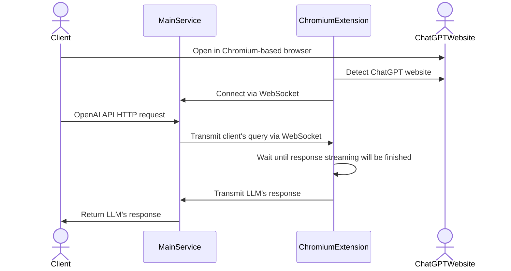

# ChatGPT website abuser

## Features

- [x] Send prompt via HTTP and receive answer
- [ ] Work with multiple chats (currently could be done via manual interaction with Web UI)
- [ ] Automatic WebSocket reconnecting

## How it works



## How to run

**Required dependencies:**

- make
- Go ([installation guide](https://go.dev/doc/install))

**Steps:**

1. [Install unpacked Chromium extension](https://developer.chrome.com/docs/extensions/get-started/tutorial/hello-world)
2. Install main service's dependencies `make install`
3. Run main service via `make run`
4. Open [chatgpt.com](https://chatgpt.com) in a browser
5. Test

```bash
curl -X POST \
    -H "Content-Type: application/json" \
    -d '{
        "input": "hello, there"
    }' \
    'http://localhost:8080/responses'
```
